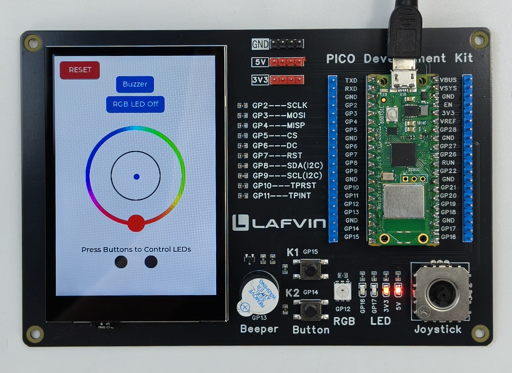
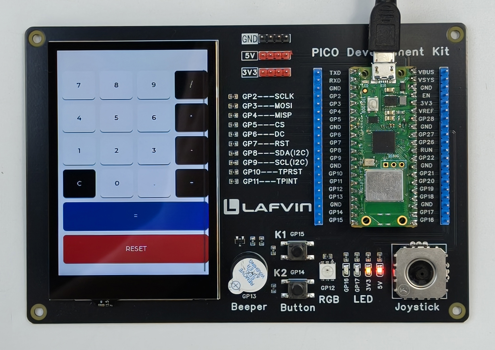

1. Quick Start Guide
===========================

This chapter will guide you to quickly get started with the Pico Development Kit. You only need to download the pre-compiled firmware file and flash it to the Pico board without setting up a complex development environment.

.. note::
   If you want to learn how to compile source code and perform secondary development, please refer to the "Advanced Development" chapter.

Preparation
------------------

Before starting, please ensure you have the following items:

* Raspberry Pi Pico development board
* Micro USB data cable (must support data transmission)
* Development kit baseboard
* A computer (Windows/Linux/macOS all supported)

Download Firmware File
------------------------

#. Visit the project's GitHub repository homepage: `LAFVIN-PICO-Development-Kit <https://github.com/lafvintech/LAFVIN-PICO-Development-Kit>`_

#. You can find the ``hello_world.UF2`` file on the release page of the project repository and download it to your computer locally

   .. tip::
      You can also download the uf2 firmware file directly by clicking this link: `hello_world.UF2 <https://github.com/lafvintech/LAFVIN-PICO-Development-Kit/releases/download/1.0/hello_world.uf2>`_

.. _flashing:

Flash Firmware to Pico
------------------------

Follow these steps to flash the firmware to your Pico development board:

**Step 1: Enter Flash Mode**
^^^^^^^^^^^^^^^^^^^^^^^^^^^^^^^^^^^

#. Press and hold the **BOOTSEL** button on the Pico board (white button)

#. While holding BOOTSEL, connect the Pico to your computer using the Micro USB cable

#. After successful connection, release the BOOTSEL button

#. Your computer should recognize a USB storage device named **RPI-RP2**

   .. image:: img/pico_usb.png

   .. attention::
      If the RPI-RP2 disk does not appear, please check:
      
      * Whether the USB cable supports data transmission (some charging cables do not support data transmission)
      * Whether the BOOTSEL button was held correctly
      * Try a different PC USB port

**Step 2: Copy Firmware File**
^^^^^^^^^^^^^^^^^^^^^^^^^^^^^^^^^^^

#. Open the RPI-RP2 disk

#. Drag or copy the downloaded ``hello_world.UF2`` file to the RPI-RP2 disk

#. After the file is copied, Pico will automatically start flashing

#. After flashing is complete, the Pico will automatically restart and the RPI-RP2 disk will disappear

   .. note::
      It is normal for the disk to disappear after flashing, indicating that the flashing has completed successfully.

**Step 3: Install to Baseboard**
^^^^^^^^^^^^^^^^^^^^^^^^^^^^^^^^^^^

#. Insert the flashed Pico into the slot on the development kit baseboard

   .. attention::
      Pay attention to the orientation of the Pico's USB port and ensure proper insertion

#. Use a USB cable to power the baseboard

#. The screen should now display the main interface

   .. image:: img/1.main_menu.jpg
      :width: 600
      :alt: Main interface display

Functional Testing
------------------

After successful flashing, let's verify that all functions are working properly.

**Main Interface Features**
^^^^^^^^^^^^^^^^^^^^^^^^^^^^^

After flashing is complete, the screen will display two function options:

* **Hardware Demo** - Hardware function demonstration
* **Calculator Demo** - Calculator demonstration

**Test Hardware Functions**
^^^^^^^^^^^^^^^^^^^^^^^^^^^^^^

#. Click the **Hardware Demo** button to enter hardware demonstration mode

#. In the hardware demo interface, you can test the following functions:

   * 🔊 **Buzzer** - Test sound output
   * 💡 **RGB LED** - Test colorful LED effects
   * 🕹️ **Joystick** - Test analog joystick input
   * 🔘 **Buttons** - Test button responses

#. Test each function in sequence to ensure the hardware is working properly

**Test Calculator Function**
^^^^^^^^^^^^^^^^^^^^^^^^^^^^^^

#. Return to the main interface and click the **Calculator Demo** button

#. Try performing simple mathematical calculations to verify the touchscreen and calculation functions

Troubleshooting
------------------

If you encounter problems, please refer to the following solutions:

**No Display on Screen**
   * Check if the Pico is correctly inserted into the baseboard
   * Check if USB power is normal
   * Try reflashing the firmware

**Abnormal Function**
   * Confirm that you downloaded the latest version of the firmware file
   * Try clearing the Pico's Flash and reflashing
   * Check if hardware connections are loose

**RPI-RP2 Disk Does Not Appear**
   * Replace the USB data cable
   * Try other USB ports
   * Ensure the BOOTSEL button was held correctly

Next Steps
------------------

Congratulations! You have successfully completed the quick start guide.

* If you want to modify code or develop your own applications, please check the :doc:`2.advanced_development` chapter

