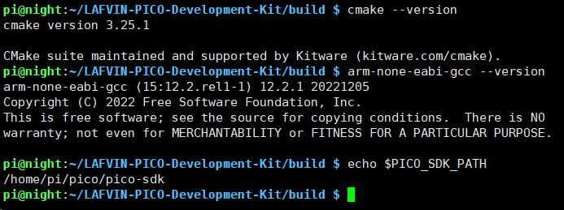

1. Development Environment Setup
==========================================

This chapter will guide you through setting up the Pico development environment to prepare for compilation and development.

.. note::
   If you only want to use the pre-compiled firmware, you don't need to set up a development environment. Please refer to :doc:`/Tutorial/1.quick_start`

System Requirements
------------------------

This tutorial supports the following Linux systems:

* **Ubuntu** 20.04 / 22.04 or newer versions
* **Raspberry Pi OS** 64-bit Bookworm version (recommended October 2024 or later)

.. attention::
   Windows and macOS users please refer to the `Pico Official Documentation <https://datasheets.raspberrypi.com/pico/getting-started-with-pico.pdf>`_ to configure the development environment.

Prerequisites
------------------

Before starting, please ensure:

* ✅ System can access apt package sources normally
* ✅ System can access GitHub normally (for downloading SDK and source code)
* ✅ Stable network connection (installation requires downloading approximately 500MB of files)

Ubuntu System Setup
---------------------

**Step 1: Update System and Install Dependencies**
^^^^^^^^^^^^^^^^^^^^^^^^^^^^^^^^^^^^^^^^^^^^^^^^^^^^^^^^^^^^^^^^

Open terminal and execute the following commands:

.. code-block:: bash

   sudo apt update
   sudo apt install cmake gcc-arm-none-eabi libnewlib-arm-none-eabi libstdc++-arm-none-eabi-newlib

.. tip::
   If prompted for insufficient permissions during installation, please ensure your account has sudo privileges.

**Step 2: Install Pico SDK**
^^^^^^^^^^^^^^^^^^^^^^^^^^^^^^^^^

Use the official automatic installation script:

.. code-block:: bash

   cd ~
   wget https://raw.githubusercontent.com/raspberrypi/pico-setup/refs/heads/master/pico_setup.sh
   chmod a+x pico_setup.sh
   ./pico_setup.sh

.. note::
   The installation script will automatically complete the following operations:
   
   * Download Pico SDK
   * Download necessary toolchains
   * Configure environment variables
   * Compile example programs
   
   The entire process takes approximately 10-20 minutes, please be patient.

**Step 3: Verify Environment Variables**
^^^^^^^^^^^^^^^^^^^^^^^^^^^^^^^^^^^^^^^^^

Check if the Pico SDK path has been set correctly:

.. code-block:: bash

   echo $PICO_SDK_PATH

If the output is empty or does not show a path, manually set the environment variable:

.. code-block:: bash

   echo 'export PICO_SDK_PATH=~/pico/pico-sdk' >> ~/.bashrc
   source ~/.bashrc

**Step 4: Download Project Source Code**
^^^^^^^^^^^^^^^^^^^^^^^^^^^^^^^^^^^^^^^^^^

Clone the complete source code of this project (including submodules):

.. code-block:: bash

   cd ~
   git clone --recursive https://github.com/lafvintech/LAFVIN-PICO-Development-Kit.git

.. attention::
   Be sure to add the ``--recursive`` parameter, which will download FreeRTOS and LVGL submodules at the same time.

Raspberry Pi OS System Setup
------------------------------------

**Step 1: Prepare Raspberry Pi System**
^^^^^^^^^^^^^^^^^^^^^^^^^^^^^^^^^^^^^^^^^^

#. Prepare an SD card (recommended 16GB or larger)

#. Use `Raspberry Pi Imager <https://www.raspberrypi.com/software/>`_ to flash the system

#. Select **Raspberry Pi OS (64-bit)** Bookworm version

#. Boot the Raspberry Pi and complete the initial setup

**Step 2: Install Development Tools**
^^^^^^^^^^^^^^^^^^^^^^^^^^^^^^^^^^^^^^^^^^

Open terminal and execute:

.. code-block:: bash

   sudo apt update
   sudo apt install cmake gcc-arm-none-eabi libnewlib-arm-none-eabi libstdc++-arm-none-eabi-newlib

**Step 3: Install Pico SDK**
^^^^^^^^^^^^^^^^^^^^^^^^^^^^^^^^^

.. code-block:: bash

   cd ~
   wget https://raw.githubusercontent.com/raspberrypi/pico-setup/refs/heads/master/pico_setup.sh -O pico_setup.sh
   chmod a+x pico_setup.sh
   ./pico_setup.sh

Wait for installation to complete (approximately 10-20 minutes).

**Step 4: Download Project Source Code**
^^^^^^^^^^^^^^^^^^^^^^^^^^^^^^^^^^^^^^^^^^

.. code-block:: bash

   cd ~
   git clone --recursive https://github.com/lafvintech/LAFVIN-PICO-Development-Kit.git

Verify Installation
---------------------

Check if all tools have been installed correctly:

.. code-block:: bash

   # Check CMake version (should be >= 3.13)
   cmake --version
   
   # Check ARM GCC toolchain
   arm-none-eabi-gcc --version
   
   # Check Pico SDK environment variable
   echo $PICO_SDK_PATH

If all commands execute correctly and display version information, the environment setup is successful!

Common Issues
------------------

**Problem: apt install fails**
   * Solution: Check network connection, try changing software sources

**Problem: pico_setup.sh download fails**
   * Solution: Check if GitHub access is normal, may need to configure proxy

**Problem: git clone is very slow**
   * Solution: Can use domestic mirrors or proxy acceleration

**Problem: Cannot find PICO_SDK_PATH during compilation**
   * Solution: Ensure ``source ~/.bashrc`` has been executed or reopen terminal

**Problem: Cannot find arm-none-eabi-gcc**
   * Solution: Reinstall with sudo apt install gcc-arm-none-eabi

**Problem: Submodules not initialized**
   * Solution: git submodule update --init --recursive

Next Steps
------------------

After completing the environment setup, you can:

* Understand project code structure → :doc:`2.code_structure`
* Start compiling the project → :doc:`3.编译项目`

