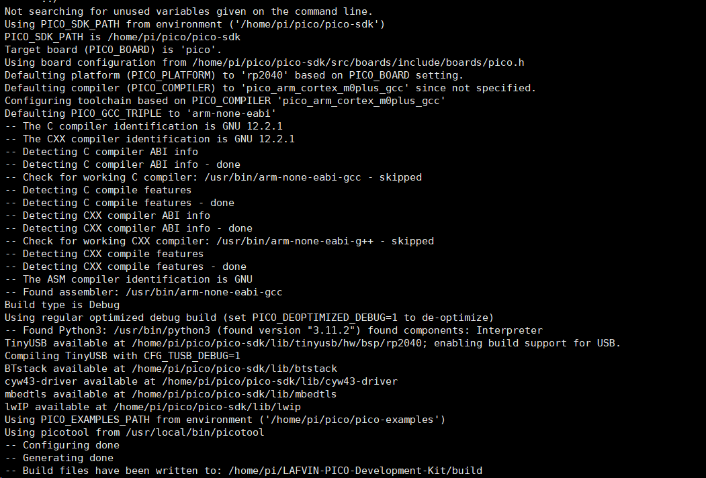
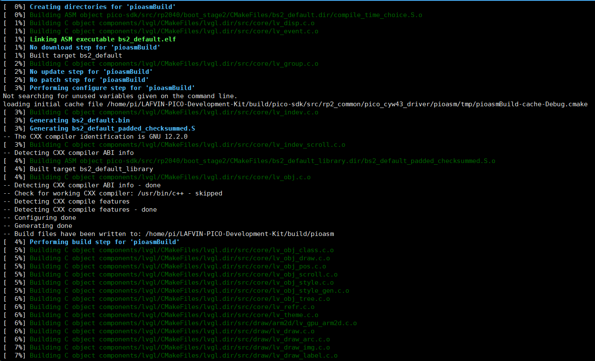

.. _compile_project:

3. Compile Project
======================

This chapter will guide you through compiling the project source code to generate flashable firmware files.

.. note::
   Before starting compilation, please ensure you have completed all steps in :doc:`1.development_environment`

Compilation Preparation
--------------------------

Confirm that you have:

* ✅ Installed Pico SDK and development toolchain
* ✅ Set the ``PICO_SDK_PATH`` environment variable
* ✅ Downloaded the project source code (including submodules)

Quick Start
------------------

If you have already configured the environment, you can directly execute the following commands to compile:

.. code-block:: bash

   cd ~/LAFVIN-PICO-Development-Kit
   mkdir build
   cd build
   cmake --no-warn-unused-cli \
         -DPICO_OPTIMIZED_DEBUG=1 \
         -DCMAKE_EXPORT_COMPILE_COMMANDS:BOOL=TRUE \
         -DCMAKE_BUILD_TYPE:STRING=Debug \
         ../
   make -j4

Detailed Compilation Steps
--------------------------

**Step 1: Enter Project Directory**
^^^^^^^^^^^^^^^^^^^^^^^^^^^^^^^^^^^^^^^

.. code-block:: bash

   cd ~/LAFVIN-PICO-Development-Kit

Confirm you are in the project root directory, you should see the ``CMakeLists.txt`` file.

**Step 2: Create Build Directory**
^^^^^^^^^^^^^^^^^^^^^^^^^^^^^^^^^^^^^^^

.. code-block:: bash

   mkdir build
   cd build

.. tip::
   Using a separate ``build`` directory keeps the source code directory clean and makes it easy to clean and recompile.

**Step 3: Run CMake Configuration**
^^^^^^^^^^^^^^^^^^^^^^^^^^^^^^^^^^^^^^^

.. code-block:: bash

   cmake --no-warn-unused-cli \
         -DPICO_OPTIMIZED_DEBUG=1 \
         -DCMAKE_EXPORT_COMPILE_COMMANDS:BOOL=TRUE \
         -DCMAKE_BUILD_TYPE:STRING=Debug \
         ../

Parameter descriptions:

* ``--no-warn-unused-cli``: Ignore warnings for unused parameters
* ``-DPICO_OPTIMIZED_DEBUG=1``: Enable optimized debug mode (**very important**, affects display and peripheral timing)
* ``-DCMAKE_EXPORT_COMPILE_COMMANDS:BOOL=TRUE``: Generate compilation command database (IDE support)
* ``-DCMAKE_BUILD_TYPE:STRING=Debug``: Set to debug version

This command will:

* Check compilation environment and dependencies
* Find Pico SDK
* Configure FreeRTOS and LVGL
* Generate Makefile

You should see the following output:

.. attention::
   If you see a ``PICO_SDK_PATH not found`` error, please return to :doc:`1.development_environment` to check environment variable settings.

**Step 4: Compile Project**
^^^^^^^^^^^^^^^^^^^^^^^^^^^^^^^^^

.. code-block:: bash

   make -j4

Parameter description:

* ``-j4``: Use 4 parallel tasks to accelerate compilation (can be adjusted based on CPU cores)

The compilation process takes approximately 2-3 minutes, you will see the following output:

**Step 5: Verify Compilation Results**
^^^^^^^^^^^^^^^^^^^^^^^^^^^^^^^^^^^^^^^

After successful compilation, check the generated files:

.. code-block:: bash

   ls -lh *.uf2

You should see the following file:

* ``hello_world.uf2`` - This is the firmware file that can be flashed to Pico

.. code-block:: bash

   # View file size
   -rw-r--r-- 1 pi pi 1.3M Nov  5 10:46 hello_world.uf2

Recompilation
------------------

**Clean and Recompile**

If you need to completely recompile:

.. code-block:: bash

   cd build
   rm -rf *
   cmake --no-warn-unused-cli \
         -DPICO_OPTIMIZED_DEBUG=1 \
         -DCMAKE_EXPORT_COMPILE_COMMANDS:BOOL=TRUE \
         -DCMAKE_BUILD_TYPE:STRING=Debug \
         ../
   make -j4

**Incremental Compilation**

If you only modified part of the code, run directly:

.. code-block:: bash

   cd build
   make -j4

Compilation Output Description
----------------------------------

After successful compilation, the ``build`` directory will contain the following files:

.. list-table::
   :header-rows: 1
   :widths: 30 70

   * - File
     - Description
   * - ``hello_world.uf2``
     - UF2 firmware file (flash to Pico)
   * - ``hello_world.elf``
     - ELF format executable file (for debugging)
   * - ``hello_world.bin``
     - Binary firmware file
   * - ``hello_world.hex``
     - HEX format firmware file
   * - ``hello_world.map``
     - Memory map file

Next Steps
------------------

After successful compilation, you can:

* **Flash Firmware**: Refer to the flashing steps in :doc:`/Tutorial/1.quick_start`
* **Modify Code**: Learn about :doc:`2.code_structure` for secondary development

.. tip::
   It is recommended to backup the compiled ``hello_world.uf2`` file for future use.

