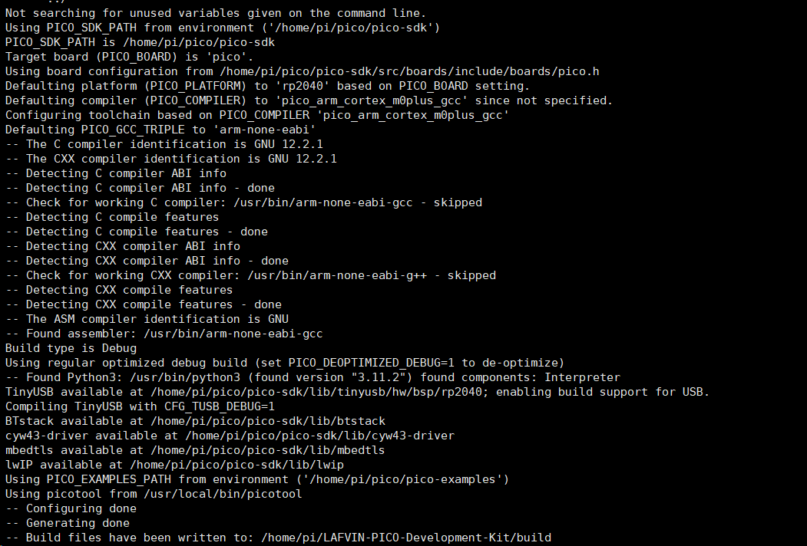
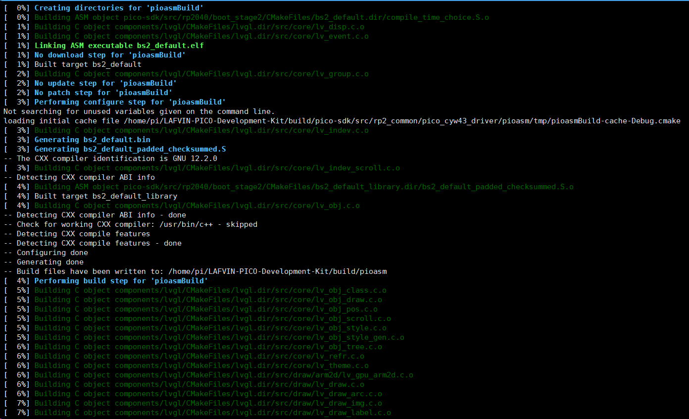

.. _compile_project:

3. Compile Project
======================

This chapter will guide you through compiling the project source code to generate flashable firmware files.

.. note::
   Before starting compilation, please ensure you have completed all steps in :doc:`1.development_environment`.

Compilation Preparation
--------------------------

Confirm that you have:

* Installed the Pico SDK and development toolchain
* Set the ``PICO_SDK_PATH`` environment variable
* Downloaded the project source code
* Initialized project submodules. If you cloned the project with ``git clone --recursive``, this is already done.

Quick Start
------------------

If you have already configured the environment, you can directly execute the following commands from the project root directory.

**Pico W / Pico WH**

.. code-block:: bash

   cd ~/LAFVIN-PICO-Development-Kit
   cmake --preset pico-w
   cmake --build --preset pico-w -j8

**Pico 2 W**

.. code-block:: bash

   cd ~/LAFVIN-PICO-Development-Kit
   cmake --preset pico2-w
   cmake --build --preset pico2-w -j8

Detailed Compilation Steps
--------------------------

**Step 1: Enter Project Directory**
^^^^^^^^^^^^^^^^^^^^^^^^^^^^^^^^^^^^^^^

.. code-block:: bash

   cd ~/LAFVIN-PICO-Development-Kit

Confirm you are in the project root directory. You should see the ``CMakeLists.txt`` and ``CMakePresets.json`` files.

**Step 2: Choose a Build Preset**
^^^^^^^^^^^^^^^^^^^^^^^^^^^^^^^^^^^^^^^

The project now uses CMake presets. You do not need to create or enter the build directory manually.

.. list-table::
   :header-rows: 1
   :widths: 25 45 30

   * - Preset
     - Target Board
     - Output Directory
   * - ``pico-w``
     - Pico W / Pico WH. The generated UF2 has also been tested on the original Pico hardware.
     - ``build/pico_w``
   * - ``pico2-w``
     - Pico 2 W
     - ``build/pico2_w``

**Step 3: Run CMake Configuration**
^^^^^^^^^^^^^^^^^^^^^^^^^^^^^^^^^^^^^^^

For Pico W / Pico WH:

.. code-block:: bash

   cmake --preset pico-w

For Pico 2 W:

.. code-block:: bash

   cmake --preset pico2-w

Parameter descriptions:

* ``pico-w``: Configures the project for Pico W / Pico WH.
* ``pico2-w``: Configures the project for Pico 2 W and enables the kit's active-low button setting.
* Both presets enable ``PICO_OPTIMIZED_DEBUG=1``, ``CMAKE_EXPORT_COMPILE_COMMANDS=TRUE``, and ``CMAKE_BUILD_TYPE=Debug``.

This command will:

* Check compilation environment and dependencies
* Find Pico SDK
* Configure the correct FreeRTOS kernel and LVGL
* Generate the build files in ``build/pico_w`` or ``build/pico2_w``

You should see output similar to the following:

.. attention::
   If you see a ``PICO_SDK_PATH not found`` error, please return to :doc:`1.development_environment` to check environment variable settings.

**Step 4: Compile Project**
^^^^^^^^^^^^^^^^^^^^^^^^^^^^^^^^^

For Pico W / Pico WH:

.. code-block:: bash

   cmake --build --preset pico-w -j8

For Pico 2 W:

.. code-block:: bash

   cmake --build --preset pico2-w -j8

Parameter description:

* ``-j8``: Use 8 parallel tasks to accelerate compilation. You can adjust this number based on your CPU cores.

The compilation process takes approximately 2-3 minutes. You will see output similar to the following:

**Step 5: Verify Compilation Results**
^^^^^^^^^^^^^^^^^^^^^^^^^^^^^^^^^^^^^^^

After successful compilation, check the generated files.

For Pico W / Pico WH:

.. code-block:: bash

   ls -lh build/pico_w/*.uf2

For Pico 2 W:

.. code-block:: bash

   ls -lh build/pico2_w/*.uf2

You should see the following file:

* ``hello_world.uf2`` - This is the firmware file that can be flashed to the target board.

Example output:

.. code-block:: bash

   -rw-r--r-- 1 pi pi 1.3M Nov  5 10:46 build/pico2_w/hello_world.uf2

Recompilation
------------------

**Clean and Recompile**

If you need to completely recompile both targets:

.. code-block:: bash

   rm -rf build/pico_w build/pico2_w
   cmake --preset pico-w
   cmake --build --preset pico-w -j8
   cmake --preset pico2-w
   cmake --build --preset pico2-w -j8

To clean only one target, remove only its build directory, for example:

.. code-block:: bash

   rm -rf build/pico2_w
   cmake --preset pico2-w
   cmake --build --preset pico2-w -j8

**Incremental Compilation**

If you only modified part of the code, run the build command directly.

For Pico W / Pico WH:

.. code-block:: bash

   cmake --build --preset pico-w -j8

For Pico 2 W:

.. code-block:: bash

   cmake --build --preset pico2-w -j8

Compilation Output Description
----------------------------------

After successful compilation, the selected build directory will contain the following files. For example, Pico 2 W outputs are located in ``build/pico2_w``.

.. list-table::
   :header-rows: 1
   :widths: 30 70

   * - File
     - Description
   * - ``hello_world.uf2``
     - UF2 firmware file, used for flashing the target board
   * - ``hello_world.elf``
     - ELF format executable file, used for debugging
   * - ``hello_world.bin``
     - Binary firmware file
   * - ``hello_world.hex``
     - HEX format firmware file
   * - ``hello_world.map``
     - Memory map file

Next Steps
------------------

After successful compilation, you can:

* **Flash Firmware**: Refer to the flashing steps in :doc:`/Tutorial/1.quick_start`
* **Modify Code**: Learn about :doc:`2.code_structure` for secondary development

.. tip::
   It is recommended to backup the compiled ``hello_world.uf2`` file for future use.
