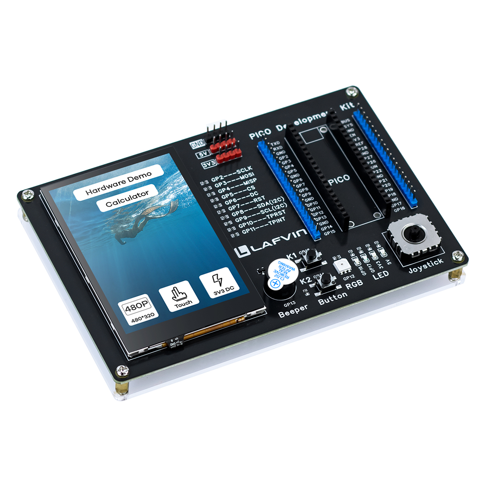

.. _about-this-kit:

About This Kit
===========================

   LAFVIN PICO Development Kit

Introduction
--------------

The LAFVIN PICO Development Kit is a versatile development board based on the Raspberry Pi Pico, designed for prototyping, learning, and experimentation.

Core Features
---------------------------

This kit integrates multiple commonly used peripherals, providing an out-of-the-box development experience:

Hardware Configuration
----------------------------------

**Display & Interaction**

* 🖥️ **3.5-inch Capacitive Touch Screen**
  
  * Resolution: 320×480 pixels
  * Display Driver: ST7796U
  * Touch Controller: GT911 (supports multi-touch)
  * Interface: SPI high-speed transmission
  
* 🕹️ **Mini PSP Joystick**
  
  * Dual-axis analog input (X/Y axis)
  * Precise analog control
  * Ideal for games and menu navigation

**Input & Output**

* 🔘 **Dual Buttons**
  
  * Programmable buttons (BTN1, BTN2)
  * Hardware debounce design
  * Supports multiple modes: long press, short press, etc.

* 🌈 **RGB LED**
  
  * WS2812 programmable full-color LED
  * Supports dynamic lighting effects
  * Can be used for status indication and visual effects

* 🔊 **Buzzer**
  
  * PWM-controlled buzzer
  * Supports tone control
  * Provides audio feedback and alert functions

* 💡 **Dual LED Indicators**
  
  * Independent LEDs (D1, D2)
  * For status display

Technical Specifications
-------------------------------

**Core Controller**

* **MCU**: Raspberry Pi Pico (RP2040)
* **Architecture**: Dual-core ARM Cortex-M0+
* **Clock**: Up to 133MHz
* **Memory**: 264KB SRAM
* **Storage**: 2MB Flash

**Peripheral Interfaces**

* **SPI**: For display communication
* **I2C**: For touch controller communication
* **ADC**: Joystick analog input
* **PWM**: Buzzer control
* **PIO**: WS2812 LED driver

**Power Supply**

* **Input Voltage**: 5V via USB
* **Operating Current**: Approx 200-500mA

Design Highlights
-------------------------------

🎯 **Developer Friendly**

* All pins clearly labeled with complete PCB markings
* Supports C/C++ and MicroPython development
* Provides complete example code and documentation
* Integrated FreeRTOS real-time operating system

🔌 **Flexible Expansion**

* Removable jumper design for easy peripheral disconnection
* Detachable 0Ω resistors for hardware isolation
* Reserved expansion interfaces

🎓 **Educational**

* Complete tutorial documentation
* Learning path from beginner to advanced
* Hardware demo and calculator example programs

Application Scenarios
-------------------------------

This kit is suitable for various application scenarios:

* 🎮 **Game Development** - Develop mini-games using touchscreen and joystick
* 🎨 **GUI Applications** - Develop user interfaces based on LVGL graphics library
* 🤖 **Embedded Learning** - Learn RTOS, peripheral drivers, and other embedded technologies
* 📊 **Data Visualization** - Real-time display of sensor data
* 🔧 **Prototype Development** - Rapid validation of ideas and functions
* 📚 **Education & Training** - Ideal for universities and training institutions

Software Support
-------------------------------

**Development Environment**

* Pico C/C++ SDK
* CMake build system
* FreeRTOS real-time operating system
* LVGL Graphics Library (v8.x)

**Provided Examples**

* Hardware function demo
* Calculator application
* Complete driver code

Quick Start
-------------------------------

* **Quick Start Guide**: :doc:`Tutorial/1.quick_start`
* **Advanced Development**: :doc:`Tutorial/2.advanced_development`
* **Hardware Details**: :doc:`component_list`

Get Support
-------------------------------

* 📖 **Documentation**: This online documentation
* 💻 **Source Code**: `GitHub Repository <https://github.com/lafvintech/LAFVIN-PICO-Development-Kit>`_
* 🌐 **Website**: www.lafvin.com

